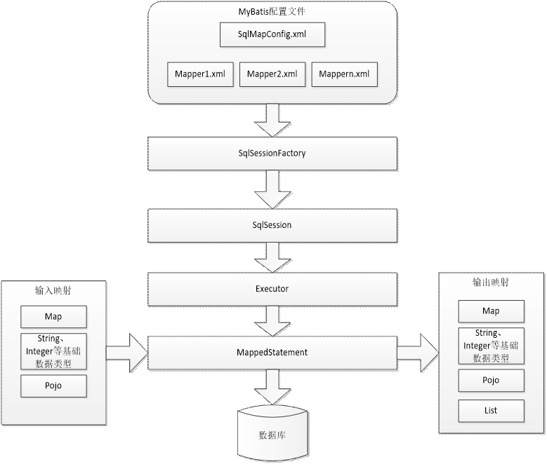

## 	Mybatis学习


[TOC]


### Mybatis : 介绍

### JDBC问题

1. 重复请求与释放资源
2. 硬编码问题 , 不易维护

### Mybatis架构



### Mybatis入门

#### 核心配置文件

```xml
<?xml version="1.0" encoding="UTF-8" ?>
<!DOCTYPE configuration
        PUBLIC "-//mybatis.org//DTD Config 3.0//EN"
        "http://mybatis.org/dtd/mybatis-3-config.dtd">
<!--
    mybatis核心配置文件 , 用于配置数据源/事务等
    结合sprig后 mybatis就数据源等操作在spring中配置
-->
<configuration>
    <environments default="development">
        <environment id="development">
            <!--设置事务管理-->
            <transactionManager type="JDBC" />
            <!--配置数据源-->
            <dataSource type="POOLED">
                <property name="driver" value="com.mysql.cj.jdbc.Driver"></property>
                <property name="url" value="jdbc:mysql://localhost:3360/mybatis"></property>
                <property name="username" value="root"></property>
                <property name="password" value="root"></property>
            </dataSource>
        </environment>
    </environments>
    <mappers>
        <mapper resource="sqlMap/user.xml" />
    </mappers>
</configuration>
```

#### Mapper映射文件

```xml
<?xml version="1.0" encoding="UTF-8" ?>
<!DOCTYPE mapper
        PUBLIC "-//mybatis.org//DTD Mapper 3.0//EN"
        "http://mybatis.org/dtd/mybatis-3-mapper.dtd">
<mapper namespace="user">
    <select id="queryUserById" parameterType="Integer" resultType="xyz.xlhp.po.User">
        select * from USER  where id = ${value}
    </select>
</mapper>
```

#### 测试类

```java
 @Test
    public void test() throws IOException {
        String resources = "sqlMapperConfig.xml";
//      获取配置文件输入流
        InputStream in = Resources.getResourceAsStream(resources);
        SqlSessionFactory sqlSessionFactory =  new SqlSessionFactoryBuilder().build(in);
        SqlSession session = sqlSessionFactory.openSession();
        User user = session.selectOne("user.queryUserById",1);
        System.out.println(user);
    }
```

#### 例子

##### 1,模糊查询

```xml
 <!--根据用户名进行模糊查询-->
    <select id="fuzzyQueryByUserName" resultType="xyz.xlhp.po.User">
        <!-- 不防止sql注入 -->
        select * from user where username like '${value}%'
        <!-- 通过mysqsl的concat函数进行字符串拼接, 防止sql注入 -->
        select * from user where username like concat(#{v},'%')
        <!-- 使用自己的字符串拼接 -->
        select * from  user where username like "%"#{value}"%"
    </select>
```

注: 

```
#{} : 占位符  可以防止sql注入
${} : 字符串拼接  如果拼接sql语句, 无法防止sql注入
```


### hibernate与mybatis的不同

#### 1,mybatis不是完整的ORm框架

#### 2,mybatis门槛低, 可以直接控制执行性能, 灵活度高

#### 3, mybatis无法做到数据库无关性

### Mapper动态代理开发

#### Demo

```java
public interface UserDao {
    /**
     * 按照用户id查询用户
     * @param id
     * @return
     */
    public User queryUserById(Integer id);
    
}
```

```xml
<?xml version="1.0" encoding="UTF-8" ?>
<!DOCTYPE mapper
        PUBLIC "-//mybatis.org//DTD Mapper 3.0//EN"
        "http://mybatis.org/dtd/mybatis-3-mapper.dtd">
<mapper namespace="xyz.xlhp.dao.UserDao">
    <!--按照id查询用户-->
    <select id="queryUserById" parameterType="Integer" resultType="xyz.xlhp.po.User">
        select * from USER  where id = #{parameter}
    </select>
</mapper>
```

```java
// 测试代码
    @Test
    public void test() throws IOException {
        InputStream inputStream = Resources.getResourceAsStream("sqlMapperConfig.xml");
        SqlSessionFactory sqlSessionFactory = new SqlSessionFactoryBuilder().build(inputStream);
        SqlSession session = sqlSessionFactory.openSession();
        UserDao userDao = session.getMapper(UserDao.class);
        User user = userDao.queryUserById(10);
        System.out.println(user);
    }
```


#### 四个要求:

1. 接口方法名需要和xml文件中的id相匹配
2. 返回值类型与Mapper.xml中的返回值类型相一致
3. 方法的入参类型与Mapper.xml中入参类型相一致
4. Mapper.xml文件中的namespace与mapper接口的路径相同

### 核心配置文件(按照顺序书写)

1. properties : 导入配置文件

2. settings : 全局配置参数

3. typeAliases : 类型别名

   ```xml
   <typeAliases>
       <typeAlias type="xyz.xlhp.po.User" alias="User"></typeAlias>
       <!-- 将po包下的所有信息进行扫描, 并将其设置上别名, 别名为类名 -->
       <package name="xyz.xlhp.po"></package>
   </typeAliases>
   ```

   还支持基本数据类型的别名, 已经设置好了, 记住就好

4. typeHandlers : 类型处理器

5. objectFactory : 对象工厂

6. plugins : 插件

7. environments : 环境集合属性对象

   1. environments : 环境子属性对象
      1. transactionManager : 事务管理
      2. dataSource : 数据源

8. mapper

   ```xml
   <mappers>
    	<!-- 配置相关xml文件路径 -->   
       <mapper resource="xyz.xlhp."></mapper>
       <!-- 使用class配置, 需要将解接口和xml文件放置在同一个包下, 并且xml文件与接口同名才可以 -->
       <mapper class="xyz.xlhp."></mapper>
       <!-- 没意义, 需要指定绝对路径 -->
       <mapper url="d://"></mapper>
       <!--需要接口和xml文件放置在同一包下, 并且同名 -->
       <package name="包路径"></package>
   </mappers>
   ```

   

