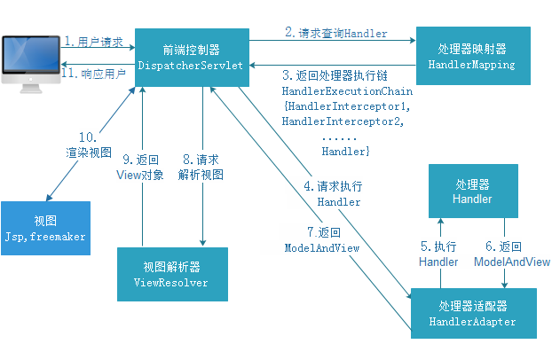

## SpringMVC入门


[TOC]


### SpringMVC介绍

### SpringMVC入门程序

1. 导入包

2. url-pattern : 拦截规则
   1.  /*  : 拦截所有, 包括jsp 等静态文件   : 建议不使用
   2.  *.do *.action : 拦截以do/action截尾的请求  : 肯定能使用
   3.  /   拦截所有 不包含jsp  但是包含其他静态资源  :  强烈建议使用

3. Demo

   ```xml
   <!--web.xml-->
    <!--配置前端控制器 , DispatcherServlet-->
       <servlet>
           <servlet-name>springMVC</servlet-name>
           <servlet-class>org.springframework.web.servlet.DispatcherServlet</servlet-class>
           <!--设置-->
           <init-param>
               <param-name>contextConfigLocation</param-name>
               <param-value>classpath:springMVC.xml</param-value>
           </init-param>
       </servlet>
       <servlet-mapping>
           <servlet-name>springMVC</servlet-name>
           <url-pattern>*.action</url-pattern>
       </servlet-mapping>
   ```

   ```xml
   springMVC.xml文件
   <?xml version="1.0" encoding="UTF-8"?>
   <beans xmlns="http://www.springframework.org/schema/beans"
          xmlns:xsi="http://www.w3.org/2001/XMLSchema-instance" xmlns:p="http://www.springframework.org/schema/p"
          xmlns:context="http://www.springframework.org/schema/context"
          xmlns:mvc="http://www.springframework.org/schema/mvc"
          xsi:schemaLocation="http://www.springframework.org/schema/beans http://www.springframework.org/schema/beans/spring-beans-4.0.xsd
           http://www.springframework.org/schema/mvc http://www.springframework.org/schema/mvc/spring-mvc-4.0.xsd
           http://www.springframework.org/schema/context http://www.springframework.org/schema/context/spring-context-4.0.xsd">
   
       <!--配置扫描器-->
       <context:component-scan base-package="xyz.xlhp.springMVCDemo"/>
   </beans>
   ```

   ```java
   //Controller层
   @Controller
   public class ItemController {
       @RequestMapping(value = "queryItems.action")
       public ModelAndView queryItems(){
           ModelAndView mav = new ModelAndView();
           // 创建页面需要显示的商品数据
           List<Item> list = new ArrayList<>();
           list.add(new Item(1, "1华为 荣耀8", 2399, new Date(), "质量好！1"));
           list.add(new Item(2, "2华为 荣耀8", 2399, new Date(), "质量好！2"));
           list.add(new Item(3, "3华为 荣耀8", 2399, new Date(), "质量好！3"));
           list.add(new Item(4, "4华为 荣耀8", 2399, new Date(), "质量好！4"));
           list.add(new Item(5, "5华为 荣耀8", 2399, new Date(), "质量好！5"));
           list.add(new Item(6, "6华为 荣耀8", 2399, new Date(), "质量好！6"));
           mav.addObject("itemList",list);
           mav.setViewName("/WEB-INF/jsp/itemList.jsp");
           return mav;
       }
   }
   
   ```

   

### SpringMVC架构讲解



#### 三大组件

1. HandlerMapping

   DefaultAnnotationHandlerMapping在3.1版本废弃, 使用RequestMappingHandlerMapping来替代他

   ```xml
   <!-- 配置处理器映射器 -->
   <bean class="org.springframework.web.servlet.mvc.method.annotation.RequestMappingHandlerMapping" />
   ```

2. HandlerAdapter

   从spring3.1版本开始，废除了AnnotationMethodHandlerAdapter的使用，推荐使用RequestMappingHandlerAdapter完成注解式处理器适配。

   ```xml 
   <!-- 配置处理器适配器 -->
   <bean class="org.springframework.web.servlet.mvc.method.annotation.RequestMappingHandlerAdapter" />
   ```

3. 注解驱动

   为了方便开发, 减少配置工作量

   直接配置处理器映射器和处理器适配器比较麻烦，可以使用注解驱动来加载。

   SpringMVC使用<mvc:annotation-driven>自动加载RequestMappingHandlerMapping和RequestMappingHandlerAdapter

   可以在springmvc.xml配置文件中使用<mvc:annotation-driven>替代注解处理器和适配器的配置。

   ```xml
   <!-- 注解驱动 -->
   <mvc:annotation-driven />
   ```

   

4. ViewResolver

   ```xml
   <!-- Example: prefix="/WEB-INF/jsp/", suffix=".jsp", viewname="test" -> 
   		"/WEB-INF/jsp/test.jsp" -->
   	<!-- 配置视图解析器 -->
   	<bean
   		class="org.springframework.web.servlet.view.InternalResourceViewResolver">
   		<!-- 配置逻辑视图的前缀 -->
   		<property name="prefix" value="/WEB-INF/jsp/" />
   		<!-- 配置逻辑视图的后缀 -->
   		<property name="suffix" value=".jsp" />
   	</bean>
   
   ```

   

### SpringMVC整合Mybatis

#### 主要配置文件内容

```xml
<beans xmlns="http://www.springframework.org/schema/beans"
       xmlns:context="http://www.springframework.org/schema/context" xmlns:p="http://www.springframework.org/schema/p"
       xmlns:aop="http://www.springframework.org/schema/aop" xmlns:tx="http://www.springframework.org/schema/tx"
       xmlns:xsi="http://www.w3.org/2001/XMLSchema-instance"
       xsi:schemaLocation="http://www.springframework.org/schema/beans http://www.springframework.org/schema/beans/spring-beans-4.0.xsd
	http://www.springframework.org/schema/context http://www.springframework.org/schema/context/spring-context-4.0.xsd
	http://www.springframework.org/schema/aop http://www.springframework.org/schema/aop/spring-aop-4.0.xsd http://www.springframework.org/schema/tx http://www.springframework.org/schema/tx/spring-tx-4.0.xsd
	http://www.springframework.org/schema/util http://www.springframework.org/schema/util/spring-util-4.0.xsd">
    <!-- 配置文件位置 -->
    <context:property-placeholder location="classpath:db.properties"></context:property-placeholder>
    <bean id="dataSource" class="com.mchange.v2.c3p0.ComboPooledDataSource">
        <property name="driverClass" value="${jdbc.driver}"></property>
        <property name="jdbcUrl" value="${jdbc.url}"></property>
        <property name="user" value="${jdbc.user}"></property>
        <property name="password" value="${jdbc.password}"></property>
    </bean>
    <!-- spring整合mybatis -->
    <!--初始化Mybatis工厂对象-->
    <bean id="sqlSessionFactory" class="org.mybatis.spring.SqlSessionFactoryBean">
        <property name="dataSource" ref="dataSource"></property>
        <!-- 配置文件 -->
        <property name="configLocation" value="classpath:sqlMappingConfig.xml"></property>
    </bean>
    <!--配置mapping文件扫描-->
    <bean class="org.mybatis.spring.mapper.MapperScannerConfigurer">
        <property name="sqlSessionFactoryBeanName" value="sqlSessionFactory"></property>
        <property name="basePackage" value="xyz.xlhp.SpringMVC_Mybatis.Dao"></property>
    </bean>

    <!--service层配置-->
    <!--配置service扫描-->
    <context:component-scan base-package="xyz.xlhp.SpringMVC_Mybatis.service"></context:component-scan>
	
    
    <!--配置事务管理器-->
    <bean id="transactionManager" class="org.springframework.jdbc.datasource.DataSourceTransactionManager">
        <property name="dataSource" ref="dataSource"></property>
    </bean>

    <!--开启事务扫描-->
    <!--<tx:annotation-driven transaction-manager="transactionManager" />-->
</beans>
```

sqlMapperConfig配置文件内容 : mybatis配置文件

```xml
<!DOCTYPE configuration
        PUBLIC "-//mybatis.org//DTD Config 3.0//EN"
        "http://mybatis.org/dtd/mybatis-3-config.dtd">
<configuration>
    <typeAliases>
        <package name="xyz.xlhp.SpringMVC_Mybatis.pojo"></package>
    </typeAliases>
</configuration>
```

springmvc.xml : springmvc配置文件内容

```xml
<?xml version="1.0" encoding="UTF-8" ?>
<beans xmlns="http://www.springframework.org/schema/beans"
       xmlns:xsi="http://www.w3.org/2001/XMLSchema-instance" xmlns:p="http://www.springframework.org/schema/p"
       xmlns:context="http://www.springframework.org/schema/context"
       xmlns:mvc="http://www.springframework.org/schema/mvc"
       xsi:schemaLocation="http://www.springframework.org/schema/beans http://www.springframework.org/schema/beans/spring-beans-4.0.xsd
        http://www.springframework.org/schema/mvc http://www.springframework.org/schema/mvc/spring-mvc-4.0.xsd
        http://www.springframework.org/schema/context http://www.springframework.org/schema/context/spring-context-4.0.xsd">
    <context:component-scan base-package="xyz.xlhp.SpringMVC_Mybatis"></context:component-scan>
    <!--配置controller层的扫描器-->
    <!--<context:component-scan base-package="xyz.xlhp.SpringMVC_Mybatis.controller"></context:component-scan>-->
    <!--注解驱动-->
    <mvc:annotation-driven></mvc:annotation-driven>
    <!--配置视图解析器-->
    <bean class="org.springframework.web.servlet.view.InternalResourceViewResolver">
        <!--配置前置视图-->
        <property name="prefix" value="/WEB-INF/jsp/"></property>
        <!--配置后置视图-->
        <property name="suffix" value=".jsp"></property>
    </bean>
</beans>
```

web.xml 配置文件内容

``` xml
<?xml version="1.0" encoding="UTF-8"?>
<web-app xmlns="http://xmlns.jcp.org/xml/ns/javaee"
         xmlns:xsi="http://www.w3.org/2001/XMLSchema-instance"
         xsi:schemaLocation="http://xmlns.jcp.org/xml/ns/javaee http://xmlns.jcp.org/xml/ns/javaee/web-app_4_0.xsd"
         version="4.0">

    <!-- 配置spring框架 -->
    <context-param>
        <param-name>contextConfigLocation</param-name>
        <param-value>classpath:applicationContext.xml</param-value>
    </context-param>
	<!-- 配置监听器 -->
    <listener>
        <listener-class>org.springframework.web.context.ContextLoaderListener</listener-class>
    </listener>
	<!-- 配置mvc前端控制器 -->
    <servlet>
        <servlet-name>springmvc</servlet-name>
        <servlet-class>org.springframework.web.servlet.DispatcherServlet</servlet-class>
        <init-param>
            <param-name>contextConfigLocation</param-name>
            <param-value>classpath:springMVC.xml</param-value>
        </init-param>
    </servlet>
    <servlet-mapping>
        <servlet-name>springmvc</servlet-name>
        <url-pattern>*.action</url-pattern>
    </servlet-mapping>
</web-app>
```

### SpringMVC参数绑定

#### 默认参数 绑定 : 用来内置对象

```java
 public ModelAndView toEdit(HttpSession session, HttpServletRequest request , HttpServletResponse response){
        ModelAndView mav = new ModelAndView();
        int id = Integer.parseInt(request.getParameter("id"));
        Items items = itemService.selectItemsById(id);
        mav.addObject("item",items);
        mav.setViewName("editItem");
        return mav;
    }
```

#### 基本数据类型

```java
 @RequestMapping(value="xxxx.action")
 public void xxxx(Integer id){
     System.out.println(id);
 }
```

#### 绑定pojo类型

```java
@RequestMapping(value="xxx.action")
public ModelAndView xxx(Pojo pojo){
    xxxxx
}
```

#### 绑定封装的pojo

```java
public class Vo{
    private Pojo pojo;
    public Pojo getPojo(){
        return this.pojo;
    }
   	public void setPojo(Pojo pojo){
        this.pojo = pojo;
   	}
}

@RequestMapping(value="xxx.action")
public ModelAndView(Vo vo){
    
}

//jsp页面中应当使用Vo类中的Pojo类型的参数名.Pojo类型的内部类型

pojo.id


```

#### 绑定自定义参数

1. 自定义Converter

   ```java
   public class DateConverter implements Converter<String,Date>{
       @Override
       public Date convert(String source){
   		try{
               //字符串转换成日期格式
               SimpleDateFormat simpleDateFormat = new SimpleDateFormat("yyyy-MM-dd HH:mm:ss");
               Date date = simpleDateFormat.parse(source);
               return date;
   		}catch(Exception e){
               e.printStackTrace();
   		}
   		return null;
   	}
   }
   ```

2. 配置自定义Converter

   ```xml
   <!--　配置注解驱动，　如果配置此标签，可以不用配置　-->
   <mvc:annotation-driven conversion-service="conversionService" />
   <!-- 转换器配置 -->
   <bean id="conversionService" class="org.springframework.format.support.FormattingConversion.ServiceFactoryBean">
       <property name="converters">
           <set>
           	 <!-- 将自定义Converter配置到Bean中,可以配置多个 -->   
           	<bean class="cn.xxx.xxx.DateConverter"></bean>
           </set>
       </property>
       
   </bean>
   ```

   ```xml
   <!--
   	第二种方法配置自定义转换器
    	此方法需要独立配置处理器映射器,适配器
   -->
   <!--注解适配器 -->
   <bean class="org.springframework.web.servlet.mvc.method.annotation.RequestMappingHandlerAdapter">
   	<property name="webBindingInitializer" ref="customBinder"></property>
   </bean>
   
   <!-- 自定义webBinder -->
   <bean id="customBinder" class="org.springframework.web.bind.support.ConfigurableWebBindingInitializer">
   	<property name="conversionService" ref="conversionService" />
   </bean>
   
   <!-- 转换器配置 -->
   <bean id="conversionService" class="org.springframework.format.support.FormattingConversionServiceFactoryBean">
   	<property name="converters">
   		<set>
   			<bean class="cn.itcast.springmvc.convert.DateConverter" />
   		</set>
   	</property>
   </bean>
   
   ```

   


#### 解决提交后POST方法的乱码问题

```xml

    <!--解决post提交参数乱码问题-->
    <filter>
        <filter-name>characterEncodingFilter</filter-name>
        <filter-class>org.springframework.web.filter.CharacterEncodingFilter</filter-class>
        <init-param>
            <param-name>encoding</param-name>
            <param-value>UTF-8</param-value>
        </init-param>
    </filter>
    <filter-mapping>
        <filter-name>characterEncodingFilter</filter-name>
        <url-pattern>*.action</url-pattern>
    </filter-mapping>

```


### SpringMVC和Struts2的区别

#### 1,springMVC入口是一个servlet前端控制器

#### 2,springMVC是基于方法的, struts2是基于类的

#### 3,struts2采用值栈存储请求和相应的参数, springMVC使用的是request封装参数

