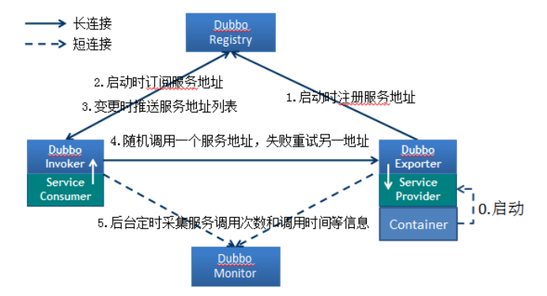

# Dubbox学习

## DubboX基本概念

### 简介：

```markdown
Dubbox 是一个分布式服务框架， 其前身是Alibaba开源项目Dubbo，后期Alibaba停止了该项目维护，当当网便在Dubbo的基础上进行优化，并继续进行维护

Dubbox致力于提供高性能和透明化的RPC远程服务调用方案，以及SOA服务治理方案。
```

### 架构说明



```
各个节点说明：
Provider： 暴露服务的服务提供方
Consumer：调用远程服务的服务消费方
Registry ： 服务注册与发现的注册中心
Monitor ：统计服务的调用次序和调用时间的监控中心
Container ：服务运行容器
```

